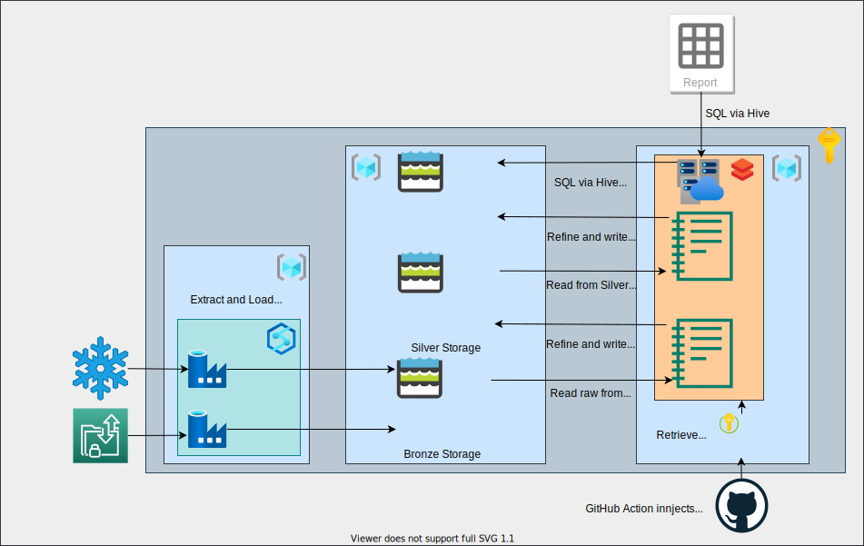

# Azure Delta Lakehouse

This repo contains information on the Delta Lakehouse Design pattern.

## What is the Delta Lakehouse?

The Delta Lakehouse is a pattern for creating repositories for raw data in a variety of formats that provides data reliability and fast analytics.

The general structure of a Delta Lakehouse consists of the Data Storage plane, the Data Ingestion plane, and the Data Processing & Presentation plane.

Below is a diagram of a typical Delta Lakehouse architecture within the Azure cloud.

In this architecture, the 3 planes are represented by the following resources:

- Data Storage
  - Azure Data Lake Gen 2 Storage Accounts, one for each data quality zone.
- Data Ingestion
  - Azure Synapse Pipelines
- Data Processing & Presentation
  - Azure Databricks

The general flow of data is to ingest the data into the Bronze Storage Account from source systems using the Azure Synapse Pipelines Data Copy Activities.  Then refine the data from Bronze to Silver, and then Silver to Gold using Azure Databricks Jobs which automate the execution of one of more Databricks Spark notebooks running the Notebooks as an Azure Active Directory Service Principle which has been granted access to the Storage Account via membership in an Azure AD Group that has been granted access to the Storage Account Containers via ACL binding.  Finally, the data is exposed from the Gold layer to the Reporting and Analytic consumers via the Databricks Spark SQL APIs which process the requests thru a dedicated data presentation Cluster in Databricks.

## Where are the origins of the Lakehouse Concept?

To better understand what a Delta Lakehouse is, we should first review the two enterprise data storage patterns that came before it:

- The Data Warehouse
- The Data Lakehouse

### The Data Warehouse

The Data Warehouse was the first enterprise data storage pattern to gain dominance in the data architecture world.  The Data Warehouse was familiar, normally using a SQL type of database that contains by a managed and structured data model.  The data model was normally implemented utilizing the tenants of the Star Schema methodology.  This enabled utilizing the Data Warehouse for Reporting and Auditing.  A key characteristic was disciplined usage.

### The Data Lake

As organizations began to realize the value of data in the internet age, the need to capture and store all types of data arose.  Data has been called 'The Oil' of the 21st century, and organizations knew they needed to collect as much raw data as possible and would figure out a way to refine the raw data. The Data Lakehouse pattern emerged as an alternative to the structure and discipline required by the Data Warehouse pattern and allowed organizations to collect terabytes of raw data in many different formats.  

### The Benefits and Drawbacks of Each Pattern

- Data Warehouse
  - Benefits
    - Familiar
    - Managed Structured Data model we can give to the business
  - Drawbacks
    - Too rigid
    - Too slow
    - Not quick enough to adapt
- Data Lake
  - Benefits
    - Flexible
    - Distributed
  - Drawbacks
    - Disorganized set of files
    - Inconsistent set of file formats
    - Inefficient file formats

### Data Lake File Formats

Below is a list of the main file formats used in data lakes

- CSV
- Avro
- Parquet
- Delta

#### CSV

> A comma-separated values (CSV) file is a delimited text file that uses a comma to separate values. Each line of the file is a data record. Each record consists of one or more fields, separated by commas. The use of the comma as a field separator is the source of the name for this file format. A CSV file typically stores tabular data (numbers and text) in plain text, in which case each line will have the same number of fields.

- Benefits
  - Human Readable
  - Easy to read and write
  - Flexible
- Drawbacks
  - Schema-on-Read, no metadata
  - No compression
  - No ACID compliance
  - Unfamiliar data processing pattern

#### Avro

> An AVRO file is a data file created by Apache Avro, an open source data serialization system used by Apache Hadoop. It contains data serialized in a compact binary format and schema in JSON format that defines the data types. AVRO files may also store markers if the datasets are too large and need to be split into subsets when processed by Apache MapReduce in Apache Hadoop.

- Benefits
  - Some compression
  - Human readable metadata
- Drawbacks
  - Not ACID compliant
  - Must have a data processing engine to read and write
  - Unfamiliar processing pattern

#### Parquet

> Apache Parquet is an open source, column-oriented data file format designed for efficient data storage and retrieval. It provides efficient data compression and encoding schemes with enhanced performance to handle complex data in bulk. Apache Parquet is designed to be a common interchange format for both batch and interactive workloads. It is similar to other columnar-storage file formats available in Hadoop, namely RCFile and ORC.

- Benefits
  - Good for storing big data of any kind, such as structured data tables, images, videos, documents.
  - Saves on cloud storage space by using highly efficient column-wise compression, and flexible encoding schemes for columns with different data types.
  - Increased data throughput and performance using techniques like data skipping, whereby queries that fetch specific column values need not read the entire row of data.
- Drawbacks
  - Not ACID compliant.
  - Must have a data processing engine to read and write.
  - Unfamiliar processing pattern.

#### Delta Lake

> Delta Lake is an open source storage layer that brings reliability to data lakes. Delta Lake provides ACID transactions, scalable metadata handling, and unifies streaming and batch data processing. Delta Lake runs on top of your existing data lake and is fully compatible with Apache Spark APIs.

- Benefits
  - Good for storing big data of any kind, such as structured data tables, images, videos, documents.
  - Saves on cloud storage space by using highly efficient column-wise compression, and flexible encoding schemes for columns with different data types.
  - Increased data throughput and performance using techniques like data skipping, whereby queries that fetch specific column values need not read the entire row of data.
  - ACID compliant.
  - Allows for Spark SQL `UPDATE` commands that provide a familiar processing pattern.
  - Automatically resolves caching issues that can arise from the use of other file formats.
- Drawbacks
  - Must have a data processing engine to read and write.
  - Requires more storage capacity compared to other options to enable ACID compatibility.

## A Brief History of Computing

### The Computing Eras

- Pre-Internet Era
- Internet Era
- Artificial Intelligence Era

### The Pre-Internet Era

The Pre-Internet Era was defined by the creation of Software Applications that were installed on User's computers.  All the data processing was done either on the User's computer or a single server when the application was deployed in a Client -> Server architecture.  Processing capacity was governed by the physical limitations of the User's Computer or the single Server.

During this era, Moore's law drove the increases in storage and computing capabilities.

> "Moore's law is a term used to refer to the observation made by Gordon Moore in 1965 that the number of transistors in a dense integrated circuit (IC) doubles about every two years.
> Moore’s law isn’t really a law in the legal sense or even a proven theory in the scientific sense (such as E = mc2). Rather, it was an observation by Gordon Moore in 1965 while he was working at Fairchild Semiconductor: the number of transistors on a microchip (as they were called in 1965) doubled about every year."

This was a natural Vertical Scaling.  Thereby Vertical Scaling was the initial paradigm to meet the world's desire for more complex computing solutions, and hence more computing power.

However with the transition from the initial computer age to the internet age and the slow down of the doubling of Moore's law due to science reaching physical limitations, Vertical Scaling was no longer able to meet the growing desire for global scale computing capacity.  Horizontal Scaling was the answer to that problem.

### The Internet Era

The Internet Era is defined by the creation of Software Systems with multiple distinct System Modules all deployed using High Availability architectures.

Many users using a single System, with much greater processing and storage capacity requirements.

Increases in the processing and storage capacity were driven by Distributed Computing.

## Google's Contribution to Distributed Computing

Google is likely the most well known organization that defined a technical solution using the Horizontal Scaling pattern to realize the world's desire for global computing solutions.

Google's open source mindset led them to publish white papers on the two pillars of their Horizontal Scaling pattern they used to collect, catalogue, and index all the webpages of the internet.

- [The Google File System](https://ai.google/research/pubs/pub51)
- [MapReduce](https://ai.google/research/pubs/pub62)

### The Google File System

The Google File System is defined in the Google whitepaper:

> "We have designed and implemented the Google File System, a scalable distributed file system for large distributed data-intensive applications. It provides fault tolerance while running on inexpensive commodity hardware, and it delivers high aggregate performance to a large number of clients."

The Google File System led to the open source project named [Hadoop Distributed File System](https://hadoop.apache.org/docs/r1.2.1/hdfs_design.html).  Per the Hadoop documentation:

> "The Hadoop Distributed File System (HDFS) is a distributed file system designed to run on commodity hardware. It has many similarities with existing distributed file systems. However, the differences from other distributed file systems are significant. HDFS is highly fault-tolerant and is designed to be deployed on low-cost hardware. HDFS provides high throughput access to application data and is suitable for applications that have large data sets. HDFS relaxes a few POSIX requirements to enable streaming access to file system data. HDFS was originally built as infrastructure for the Apache Nutch web search engine project. HDFS is now an Apache Hadoop subproject. The project URL is <https://hadoop.apache.org/hdfs/>."

### MapReduce

MapReduce is defined in the Google whitepaper as follows:

> "MapReduce is a programming model and an associated implementation for processing and generating large
data sets. Users specify a map function that processes a key/value pair to generate a set of intermediate key/value pairs, and a reduce function that merges all intermediate values associated with the same intermediate key....
>
> Programs written in this functional style are automatically parallelized and executed on a large cluster of commodity machines. The run-time system takes care of the details of partitioning the input data, scheduling the program’s execution across a set of machines, handling machine failures, and managing the required inter-machine communication. This allows programmers without any
experience with parallel and distributed systems to easily utilize the resources of a large distributed system."

MapReduce led to the open source project named [Apache Spark]([documents/spark-the-definitive-guide.pdf](https://analyticsdata24.files.wordpress.com/2020/02/spark-the-definitive-guide40www.bigdatabugs.com_.pdf)).  Per the book "Spark The Definitive Guide":

> "Apache Spark is a unified computing engine and a set of libraries for parallel data processing on
computer clusters. As of this writing, Spark is the most actively developed open source engine
for this task, making it a standard tool for any developer or data scientist interested in big data.
Spark supports multiple widely used programming languages (Python, Java, Scala, and R),
includes libraries for diverse tasks ranging from SQL to streaming and machine learning, and
runs anywhere from a laptop to a cluster of thousands of servers. This makes it an easy system to
start with and scale-up to big data processing or incredibly large scale."

The Apache Spark architecture is shown below, most of the development done using Apache Spark is against the Structured APIs.

### Spark

Apache Spark's execution model consists of submitting the execution of a Spark application via the `spark-submit` command.  When the `spark-submit` command is issued to the Spark Cluster, then several things are created:

- Driver Process
- Spark Session
- Executor Processes

Below are three examples of a `spark-submit' invocation:

    // Driver Process and Spark Session hosted on a Cluster Node
    spark-submit \
      -- class my.app.name \
      -- master k8s://11.22.33:404
      -- driver-memory 20G
      -- driver-cores 4
      -- num-executors
      -- executor-memory 20G
      -- executor-cores 4
      -- deploy-mode cluster

    // Driver Process and Spark Session hosted on the User's Computer
    spark-submit \
      -- class my.app.name \
      -- master k8s://11.22.33:404
      -- num-executors
      -- executor-memory 20G
      -- executor-cores 4
      -- deploy-mode client

    // Everything hosted on the User's Computer
    spark-submit \
      -- class my.app.name \
      -- master local[3]

## Databricks

Databricks is the world's first Delta Lakehouse Platform that is created by the creators of Spark and the Delta Lake file format.

### Databricks and GitHub

Databricks repos can help facilitate CI/CD workflows by enabling commits and code pushes to GitHub that can trigger CI/CD processes.

### Delta Tables

Delta Tables enable SQL like code and interactions to data that reside within Delta Lake file formats within a Distributed Storage account.

Below is an example of code to create a database located in a specific storage location:

    CREATE DATABASE IF NOT EXISTS customer360 LOCATION
'/customer/customer360';

Below is an example of code to create a Delta table within the DBFS (also called a managed table):

     CREATE OR REPLACE TABLE table_name (
      id STRING,
      birthDate DATE,
      avgRating FLOAT
      )

A Delta table can also be created by adopting column names and data types from a `SELECT` query as shown below:

    CREATE TABLE customersPerCountry AS
    SELECT country, COUNT(*) AS customers
    FROM customerLocations
    GROUP BY country;

Data can be appended to a Delta Table using the following SQL keywords:

    INSERT INTO

Z-Ordering can be used to improve performance of queries when target records are sparsely located throughout data files.

To dedupliacte records returned in a query from a Delta Table, use the `DISTINCT` operator.

    SELECT DISTINCT * FROM my_table;

## Data Modeling in a Lakehouse

With the rise in the ETL and ELT market share of platforms such as Databricks and Azure Data Lake Gen 2, it is clear that the Delta Lakehouse data ingestion and storage pattern is here to stay.  With that, the question becomes 'What is the best data modeling technique for the Delta Lakehouse'.

### Dimensional Modeling

The question of whether Dimensional Modeling is still relevant within a Delta Lakehouse, it is important to review the aspects and benefits of Dimensional Modeling.

Per wikipedia, Dimensional Modeling is described as:

> "Dimensional modeling always uses the concepts of facts (measures), and dimensions (context). Facts are typically (but not always) numeric values that can be aggregated, and dimensions are groups of hierarchies and descriptors that define the facts. For example, sales amount is a fact; timestamp, product, register#, store#, etc. are elements of dimensions. Dimensional models are built by business process area, e.g. store sales, inventory, claims, etc. Because the different business process areas share some but not all dimensions, efficiency in design, operation, and consistency, is achieved using conformed dimensions, i.e. using one copy of the shared dimension across subject areas.
>
> Dimensional modeling does not necessarily involve a relational database. The same modeling approach, at the logical level, can be used for any physical form, such as multidimensional database or even flat files. It is oriented around understandability and performance."

Along with Fact and Dimension datasets, several other key concepts are used within standard data modeling techniques:

- Keys and Key Types
- Dimension Type

#### Keys and Key Types

Keys within Data Warehouses are used to denote uniqueness and allow the joining of records from Fact datasets to records within Dimension datasets.

There are two main types of Keys in dimensional modeling that provide record uniqueness:

- Natural Key
  - The Primary Key from the Transactional Source System.
- Surrogate Key
  - The warehouse's Primary Key.
  - Should be kept to a single field, no compound surrogate keys, because we do not want to have multiple keys on our Fact table to tie back to the Dimensional table.
  - Should be an Integer value instead of a Globally Unique Identifier (GUID) because GUID's require 16 bytes where Integers require only 4 bytes.
  - Used to insulate the data warehouse from changes in the Natural Key, such as a new Transactional Source System or acquisition of other companies, therefore should not be a derivative of the Natural Key(s).

#### Dimension Types

There are 8 dimension types in dimensional modeling, however only 3 are used:

- Type 0
  - Data cannot change
- Type 1
  - Data can change but no historical records are kept
- Type 2
  - Data can change and historical records are kept predominantly via record expiration using Start and End Date fields.

### Canonical Data Objects

An alternate to Dimensional Modeling is Canonical Data Modeling.  Canonical Data Modeling aims to present entities and relationships in the simplest possible form.  Canonical Data Modeling first started with system integration where the Canonical Data Model was used to communicate between separate systems.  It was intended to reduce costs by standardizing on agreed data definitions associated with integrating business systems.

## References

- [Access Azure Data Lake Storage Gen2 or Blob Storage using OAuth 2.0 with an Azure service principal](https://docs.microsoft.com/en-us/azure/databricks/data/data-sources/azure/azure-storage#access-azure-data-lake-storage-gen2-or-blob-storage-using-oauth-20-with-an-azure-service-principal)
- [Apache Spark](https://slower.udemy.com/course/apache-spark-programming-in-python-for-beginners/learn/lecture/20156416#overview)
- [Apache Spark in Wikipedia](https://en.wikipedia.org/wiki/Apache_Spark)
- [AVRO File Extension](https://fileinfo.com/extension/avro#:~:text=An%20AVRO%20file%20is%20a%20data%20file%20created,in%20JSON%20format%20that%20defines%20the%20data%20types.)
- [Comma-separated values](https://en.wikipedia.org/wiki/Comma-separated_values)
- [Creating and mounting an Azure data lake in Databricks via Terraform](https://federico.is/posts/2020/09/16/mount-azure-data-lake-in-databricks-via-terraform/)
- [Databricks architecture overview](https://docs.databricks.com/getting-started/overview.html)
- [Databricks, Delta Lake and You - Simon Whiteley](https://www.youtube.com/watch?v=y91r_DLMEq8)
- [Databricks on Azure with Terraform](https://brendanthompson.com/posts/2021/08/databricks-on-azure-with-terraform)
- [Data Modelling: From Single Table To Star Schema - Chris Barber](https://www.youtube.com/watch?v=F4tK0dwJKU4)
- [Delta Lake guide](https://docs.microsoft.com/en-us/azure/databricks/delta/)
- [The Delta Lake Series Lakehouse](https://databricks.com/wp-content/uploads/2021/04/The-Delta-Lake-Series-Lakehouse-012921.pdf?itm_data=nurturety-card-lakehouse-pdf)
- [The Google File System](https://static.googleusercontent.com/media/research.google.com/en//archive/gfs-sosp2003.pdf)
- [Hadoop Distributed File System](https://hadoop.apache.org/docs/r1.2.1/hdfs_design.html)
- [MapReduce](https://static.googleusercontent.com/media/research.google.com/en//archive/mapreduce-osdi04.pdf)
- [Moore's Law](https://www.synopsys.com/glossary/what-is-moores-law.html#:~:text=Definition,as%20E%20%3D%20mc2)
- [Parquet](https://databricks.com/glossary/what-is-parquet#:~:text=What%20is%20Parquet%3F%20Apache%20Parquet%20is%20an%20open,enhanced%20performance%20to%20handle%20complex%20data%20in%20bulk.)
- [Spark Programming in Python for Beginners](https://slower.udemy.com/course/apache-spark-programming-in-python-for-beginners)

## Potential Demo Data Source

- [Example set of Sales Data](https://eforexcel.com/wp/downloads-18-sample-csv-files-data-sets-for-testing-sales/)
